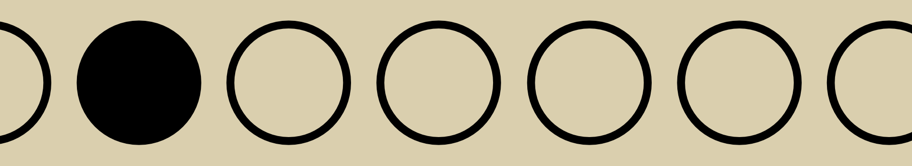

# AeroBar

**A minimalist macOS menu bar utility to display your current AeroSpace workspace.**

  

---

AeroBar provides a simple, at-a-glance view of your active [AeroSpace](https://github.com/nikitabobko/AeroSpace) workspace directly in your macOS menu bar. It shows your current space and the total number of spaces like this: `[○○●○○○○]`

---

## Requirements

*   macOS (tested on macOS Sonoma running on apple silicon, should work on recent versions)
*   [AeroSpace](https://github.com/nikitabobko/AeroSpace) window manager installed and configured.

## Installation
1.  Go to the [**Releases page**](https://github.com/stneric/AeroBar/releases/tag/AeroBar).
2.  Download the `AeroBar.app.zip` file from the latest release.
3.  Unzip the file.
4.  Drag `AeroBar.app` to your `/Applications` folder.
5.  Launch AeroBar.
    *   On the first launch, macOS may ask for permission to run an app from an unidentified developer. You might need to go to `System Settings > Privacy & Security`, scroll down, and click "Open Anyway" for AeroBar.
    *   The app also requires permissions to execute the `aerospace` command. You might be prompted, or you might need to ensure the app has the necessary sandbox exceptions (currently handled by disabling the sandbox for process execution).

## Usage

Once installed and launched, AeroBar will appear in your menu bar. It automatically detects AeroSpace workspace changes.
It also starts at login.

## Known Issues & Limitations

*   **AeroSpace CLI Path:** AeroBar currently looks for the `aerospace` command-line interface (CLI) in these common locations:
    *   `/opt/homebrew/bin/aerospace`
    *   `/usr/local/bin/aerospace`
    *   `/usr/bin/aerospace`
    If your `aerospace` CLI is installed elsewhere, AeroBar may not find it and will display an error or "No AeroSpace" in the menu bar.
*   **Proof of Concept:** This is an early version. While functional for its core purpose, there might be edge cases or bugs.
*   **Sandbox:** For simplicity in this proof-of-concept, the app sandbox is currently disabled (`com.apple.security.app-sandbox` set to `false` in entitlements) to allow execution of the `aerospace` CLI.

## Future Ideas

If there's community interest, AeroBar could be enhanced.

## Contributing

Feedback, bug reports, and feature requests are welcome! Please feel free to open an issue or submit a pull request.

---

## Commercial Use

AeroBar is provided freely with the hope that it's useful. While the MIT license permits commercial use, it is my preference that this specific project and direct derivatives are not primarily used for commercial profit without prior discussion. I encourage building upon it for the community's benefit.

---

*This project is not affiliated with the official AeroSpace project.*

